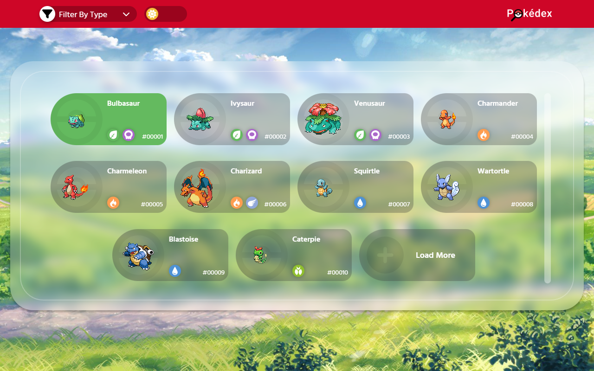
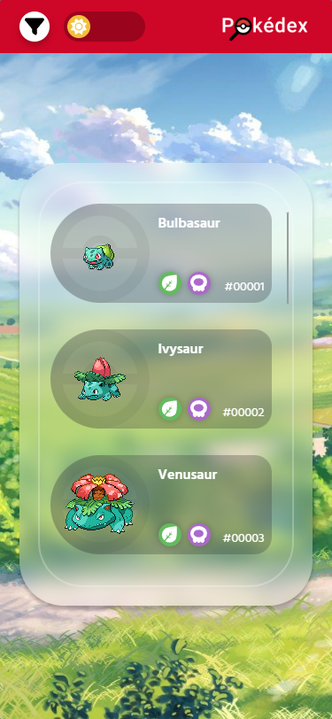
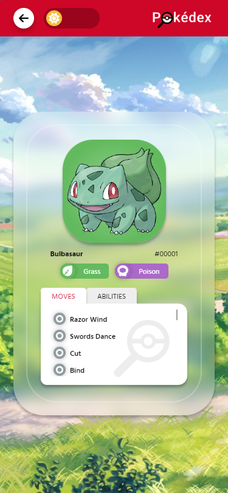
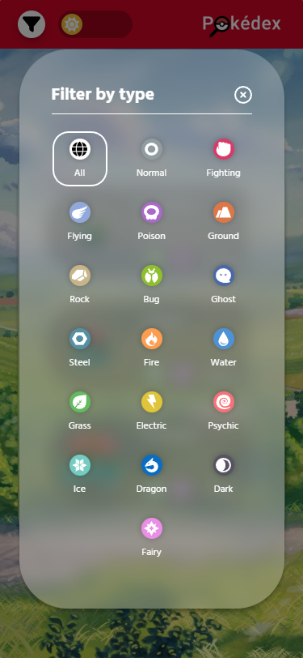
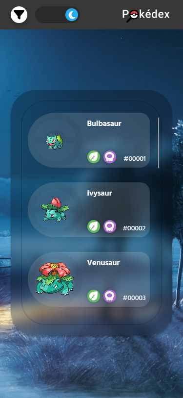
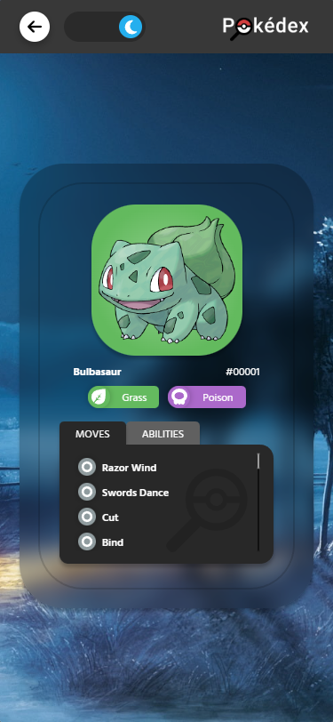
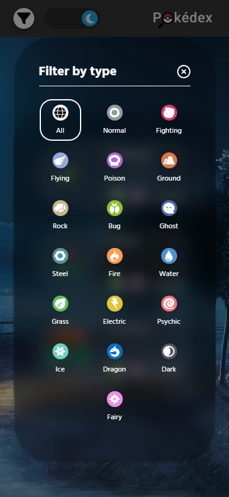

<div align="center">
  
</div>
<h1 align="center"></h1>
<p align="center">
    <a href="https://pokedex-nu-ten.vercel.app/" target="_blank">Pokédex</a> é um projeto feito em <a href="https://reactjs.org/">React JS</a> no formato de Single Page Application (SPA), alimentada pela <a href="https://pokeapi.co/">PokéAPI</a>. Sua finalidade é listar e mostrar informações dos pokemons existentes na série de jogos eletrônicos.</a> 
</p>




## 💬 Sobre o projeto

### Detalhes

Pokédex realiza uma listagem inicial de 10 pokémons, ao selecionar algum, o usuário é direcionado para uma página, onde conterá informações de nome, id, tipos, lista de movimentos e lista de habilidades com descrição.

O usuário também poderá filtrar a lista de pokémons por tipos, utilizando o menu dropdown localizado na barra de navegação. No final de cada listagem, haverá um botão que permite adicionar mais 10 itens a lista, caso o servidor tenha mais alguns.

É possível trocar o tema da aplicação para cores mais claras (Modo Dia) ou mais escuras (Modo Noite), há um botão delegado para esta função, localizado na barra de navegação.

### Ferramentas

- <b>PokeApi</b>: Utilizado como base de coleta das informações dos pokemons, requerimento obrigatório pelo desafio do curso.

- <b>React Router</b>: Utilizado para mapear as rotas da aplicação, evitando assim o recarregamento das páginas e definindo o aspecto SPA (Single Page Application).

- <b>styled-components</b>: Usado para evitar possíveis bugs de classes CSS e tornar a estilização mais dinâmica.

- <b>Fonts Awesome</b>: Aplicado para implementar alguns ícones nos componentes.

- <b>Jest</b>: Utilizado como meu principal test runner, rápido e simples de utilizar.

- <b>React Testing Library</b>: Foi adotada essa ferramenta para efetuar os testes de software e manter o código manutenível, proporcionando maior segurança durante os momentos de refatoração.

### Planejamento

Foi feito uma lista dos requisitos funcionais através da proposta fornecida pelo curso <a href="https://www.linkedin.com/school/devquest-dev-em-dobro/">DevQuest Dev em Dobro</a>, para estipular um prazo de finalização do projeto e dividir em partes menores para serem finalizados dentro do tempo disponível de cada dia.


Nos primeiros dias foi planejado e desenvolvido o layout usando Figma, com finalidade de facilitar no desenvolvimento da estrutura da página e coleta de recursos gráficos. Após sua conclusão, realizou-se o desenvolvimento do projeto em React JS, começando pela estruturação das pastas, coleta de imagens, fontes, estilos de reset e por fim sua codificação.


Após a finalização dos códigos, foi feita a remoção dos arquivos desnecessários, efetuado os testes das funcionalidades e responsividade em diferentes resoluções, para garantir a qualidade do projeto.

## 🛠 Guia de instalação

1. Faça o clone do projeto
    ```
    git clone https://github.com/jonathanBenedito/pokedex.git
    ```

2. Acesse o repositório
    ```
    cd pokedex
    ```

3. Instale o pacote do projeto
    ```
    npm install
    ```

4. Inicialize o app
    ```
    npm start
    ```

## 🧱 Tecnologias

- React JS
- Javascript
- CSS

## 🔗 Links

Website: <a href="https://pokedex-nu-ten.vercel.app/">pokedex-nu-ten.vercel.app</a>
<br />
DevQuest - Dev em Dobro (Linkedin): <a href="https://www.linkedin.com/school/devquest-dev-em-dobro/" target="_blank">linkedin.com/school/devquest-dev-em-dobro</a>
<br />
PokéAPI: <a href="https://pokeapi.co/">pokeapi.co</a>
<br />

## 🖼 Fotos (Mobile)

### Tema (Modo Dia)
|   |  |  |
|:---:|:---:|:---:|
| Homepage | Detalhes do pokemon | Modal de filtro

### Tema (Modo Noite)
|   |  |  |
|:---:|:---:|:---:|
| Homepage | Detalhes do pokemon | Modal de filtro
